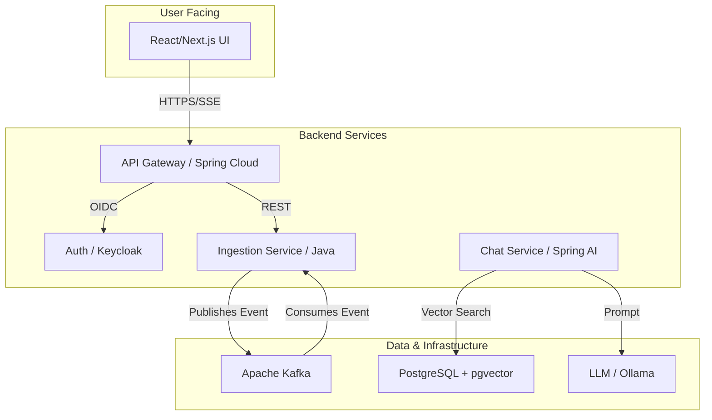

# Project Phoenix: Enterprise RAG Knowledge Platform


A secure SaaS platform enabling enterprises to query their confidential documents via an intelligent chat interface, powered by **Retrieval-Augmented Generation (RAG)**.

---

## Architecture

The system follows a containerized microservices architecture with asynchronous, event-driven communication.



---

## Tech Stack

| Domain | Technology | Role |
|--------|------------|------|
| Backend | Java 21, Spring Boot 3.3, Spring AI | Business logic, AI processing, APIs |
| Frontend | React 19 (Vite), TypeScript, Tailwind CSS | User interface, Real-time chat |
| Data | PostgreSQL 16 + pgvector | Metadata and vector storage |
| Messaging | Apache Kafka | Asynchronous ingestion pipeline |
| Security | Keycloak (OIDC) | Authentication & Authorization (RBAC) |
| DevOps | Docker, Docker Compose, GitHub Actions | Containerization, Orchestration, CI/CD |
| AI (Local) | Ollama (Llama3/Mistral) | Large Language Model for text generation |

---

## Quick Start

**Prerequisites:** Docker and Docker Compose must be installed.

1. **Clone the repository:**
```bash
git clone https://github.com/Youss2f/phoenix-rag-platform.git
cd phoenix-rag-platform
```

2. **Configure environment:**
```bash
cp .env.example .env
```

3. **Launch the full stack:**
```bash
docker-compose up -d --build
```

4. **Access the application:**
   - Frontend: http://localhost:3000
   - Keycloak Admin: http://localhost:8080 (admin/admin)
   - API Gateway: http://localhost:8081

---

## Configuration

Create a `.env` file at the project root based on `.env.example`:

```properties
# PostgreSQL
POSTGRES_DB=phoenix_db
POSTGRES_USER=admin
POSTGRES_PASSWORD=secret

# Keycloak
KEYCLOAK_ADMIN=admin
KEYCLOAK_ADMIN_PASSWORD=admin
```

---

## Project Structure

```
phoenix-rag-platform/
├── .github/
│   ├── workflows/
│   │   └── ci-pipeline.yml
│   ├── ISSUE_TEMPLATE/
│   └── PULL_REQUEST_TEMPLATE.md
├── backend/
│   ├── src/main/java/
│   └── pom.xml
├── frontend/
│   ├── src/
│   └── package.json
├── docker-compose.yml
├── .env.example
└── README.md
```

---

## Development

### Backend
```bash
cd backend
./mvnw spring-boot:run
```

### Frontend
```bash
cd frontend
npm install
npm run dev
```

---

## Testing

```bash
# Unit tests
cd backend && ./mvnw test

# Integration tests with Testcontainers
cd backend && ./mvnw verify
```

---

## License

This project is licensed under the MIT License.
